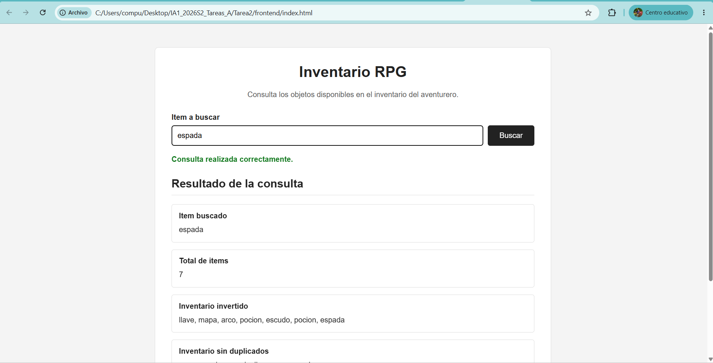
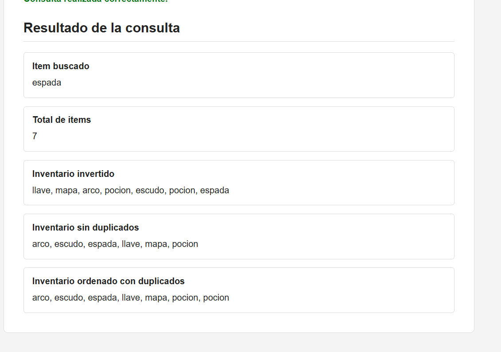

# Tarea 2 
**Curso:** Inteligencia Artificial 1  
**Semestre:** Segundo Semestre 2026  
**Universidad de San Carlos de Guatemala - Facultad de Ingeniería**  

---


##  Descripción General

La **Tarea 2** consiste en el desarrollo de un sistema web integral que combina la **programación lógica** en Prolog con un backend en Python y una interfaz de usuario interactiva en el frontend.

El sistema simula el **inventario de un aventurero RPG**, permitiendo consultar la existencia de ítems principales y secundarios, concatenar listas, calcular totales, invertir el orden de los objetos y ordenarlos tanto con como sin elementos duplicados mediante inferencia lógica en Prolog.

---

##  Arquitectura del Sistema

El flujo de comunicación entre componentes sigue un modelo multicapa:


---

## 📁 Estructura del Proyecto

```text
Tarea2/
├── backend/
│   ├── inventario.pl      # Base de conocimiento y reglas lógicas en Prolog
│   ├── main.py            # Servidor API REST en Python (FastAPI + PySwip)
│   └── venv/              # Entorno virtual de Python
└── frontend/
    ├── index.html         # Estructura semántica de la interfaz de usuario
    ├── script.js          # Lógica de consumo de API y manipulación del DOM
    └── style.css          # Estilos visuales adaptados a temática RPG
```

---

##  Explicación del Código por Componentes

### 1. Motor Lógico en Prolog (`inventario.pl`)

El archivo Prolog define los hechos de la base de conocimiento y los predicados necesarios para manipular el inventario.

#### **A. Definición de Hechos (`items_principales/1` y `items_secundarios/1`)**
* `items_principales/1`: Almacena la lista de objetos principales del aventurero, incluyendo al menos 4 elementos y un elemento duplicado (`pocion`).
* `items_secundarios/1`: Almacena la lista de objetos secundarios con al menos 3 elementos distintos.

```prolog
items_principales([espada, pocion, escudo, pocion]).
items_secundarios([arco, mapa, llave]).
```

#### **B. Regla Recursiva (`mostrar_inventario/1`)**
Recorre de manera recursiva cualquier lista de elementos e imprime cada ítem en la consola mediante `writeln/1`.
* **Caso Base:** Cuando la lista está vacía `[]`, la recursión finaliza con éxito.
* **Caso Recursivo:** Desestructura la lista en `[Cabeza | Cola]`, imprime `Cabeza` y realiza la llamada recursiva con `Cola`.

```prolog
mostrar_inventario([]).
mostrar_inventario([Cabeza | Cola]) :-
    writeln(Cabeza),
    mostrar_inventario(Cola).
```

#### **C. Regla Principal (`procesar_inventario/5`)**
Predicado de aridad 5 que realiza todo el procesamiento lógico:
1. Obtiene las listas de hechos `items_principales` e `items_secundarios`.
2. `append/3`: Concatena ambas listas en `InventarioGeneral`.
3. `length/2`: Calcula la cantidad total de elementos (`TotalItems`).
4. `member/2`: Verifica mediante unificación que el `ItemBuscado` exista en el inventario. Si no existe, la regla falla.
5. `reverse/2`: Invierte el orden de la lista general (`InventarioInvertido`).
6. `sort/2`: Ordena alfabéticamente la lista eliminando elementos duplicados (`InventarioUnico`).
7. `msort/2`: Ordena alfabéticamente la lista conservando elementos duplicados (`InventarioOrdenado`).
8. Llama al predicado recursivo `mostrar_inventario/1`.

```prolog
procesar_inventario(ItemBuscado, TotalItems, InventarioInvertido, InventarioUnico, InventarioOrdenado) :-
    items_principales(Principales),
    items_secundarios(Secundarios),
    append(Principales, Secundarios, InventarioGeneral),
    length(InventarioGeneral, TotalItems),
    member(ItemBuscado, InventarioGeneral),
    reverse(InventarioGeneral, InventarioInvertido),
    sort(InventarioGeneral, InventarioUnico),
    msort(InventarioGeneral, InventarioOrdenado),
    mostrar_inventario(InventarioGeneral).
```

---

### 2. Backend en Python + FastAPI (`main.py`)

El servidor Python actúa como puente entre la interfaz web y el motor de Prolog a través de **PySwip**.

#### **A. Configuración de CORS y PySwip**
Se habilita el middleware CORS para recibir peticiones de cualquier origen web y se carga el archivo `inventario.pl` mediante la ruta absoluta resolviendo la ubicación del script.

```python
from pathlib import Path
from fastapi import FastAPI, HTTPException
from fastapi.middleware.cors import CORSMiddleware
from pyswip import Prolog

app = FastAPI(title="API Inventario RPG")

app.add_middleware(
    CORSMiddleware,
    allow_origins=["*"],
    allow_methods=["GET"],
    allow_headers=["*"],
)

BASE_DIR = Path(__file__).resolve().parent
prolog = Prolog()
prolog.consult((BASE_DIR / "inventario.pl").as_posix())
```

#### **B. Conversión Recursiva de Datos (`convertir_prolog/1`)**
Convierte las estructuras de datos de PySwip (como átomos o listas internas) en tipos nativos de Python (`str`, `int`, `list`) listos para la serialización JSON.

```python
def convertir_prolog(valor):
    if isinstance(valor, list):
        return [convertir_prolog(elemento) for elemento in valor]
    if isinstance(valor, (int, float)):
        return valor
    return str(valor)
```

#### **C. Endpoint `GET /inventario`**
* **Sanitización y Seguridad:** Valida que el parámetro recibido contenga únicamente caracteres alfanuméricos mediante expresiones regulares para evitar inyección de comandos en Prolog (`re.fullmatch(r"[a-zA-Z_][a-zA-Z0-9_]*", item)`).
* **Ejecución:** Invoca `prolog.query(...)` pasando los argumentos unificados.
* **Manejo de Errores:** Si el ítem no existe en el inventario (`member/2` falla), se retorna una respuesta HTTP `404 Not Found`.

---

### 3. Frontend Web (`index.html`, `script.js`, `style.css`)

* **`index.html`**: Define un formulario accesible con un campo de texto `<input id="item">` y contenedores para presentar los resultados de la consulta.
* **`script.js`**:
  * Escucha el evento `submit` del formulario.
  * Realiza una petición asíncrona mediante `fetch` al backend `http://127.0.0.1:8000/inventario?item=...`.
  * Formatea las listas devueltas con `.join(", ")` para su despliegue visual en la interfaz.
  * Muestra mensajes de estado y error dinámicos (éxito en verde, error en rojo).
* **`style.css`**: Proporciona una interfaz limpia, adaptativa y tematizada para juegos de rol (RPG).

---

##  Requisitos de Instalación

1. **SWI-Prolog** instalado en el sistema y agregado a las variables de entorno (`PATH`).
2. **Python 3.10+**.
3. Dependencias de Python instaladas en el entorno virtual:
   ```bash
   pip install fastapi uvicorn pyswip
   ```

---

##  Guía de Ejecución

### 1. Iniciar el Backend
En una terminal, ejecuta los siguientes comandos:
```cmd
cd Tarea2\backend
.\venv\Scripts\activate
uvicorn main:app --reload
```
> El servidor quedará listo en `http://127.0.0.1:8000`.

### 2. Iniciar el Frontend
Elige **una** de las siguientes opciones:

* **Opción Directa:** Abre el archivo `index.html` directamente en tu navegador web.
* **Opción HTTP Server (Puerto 8080):** En una nueva terminal ejecuta:
  ```cmd
  cd Tarea2\frontend
  python -m http.server 8080
  ```
  Y navega a `http://127.0.0.1:8080`.

---

##  Casos de Prueba y Resultados

| Caso de Prueba | Parámetro `item` | Estado HTTP | Resultado Esperado |
| :--- | :--- | :---: | :--- |
| **Ítem Válido (Duplicado)** | `pocion` | `200 OK` | Retorna total `7`, muestra listas invertida, única (6 ítems) y ordenada (7 ítems). |
| **Ítem Válido (Único)** | `espada` | `200 OK` | Retorna exitosamente la información del inventario. |
| **Ítem Inexistente** | `hacha` | `404 Not Found` | Muestra el mensaje *"El ítem 'hacha' no existe en el inventario del aventurero"*. |
| **Caracteres Inválidos** | `espada; halt.` | `400 Bad Request` | Frena la ejecución por validación Regex contra inyección sintáctica. |



